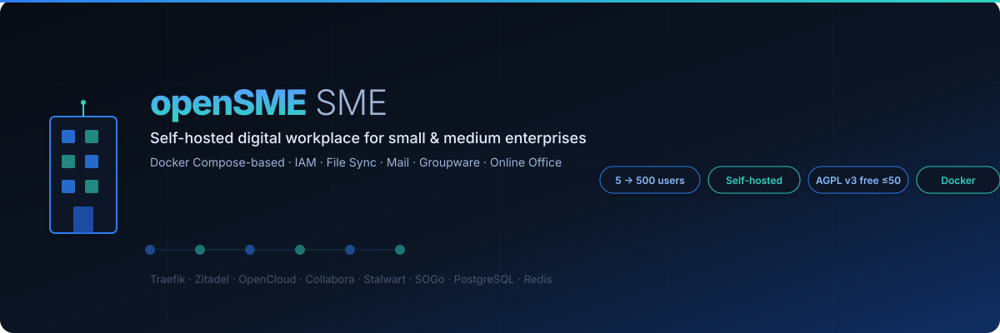
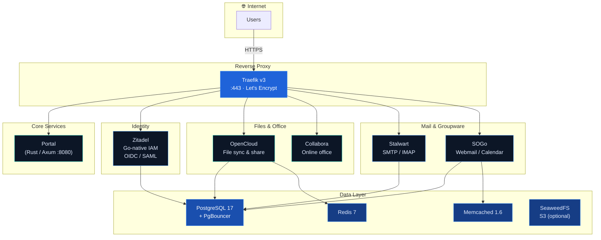

<div align="center">



# openSME

**Self-hosted digital workplace for small &amp; medium enterprises.**

openSME is an **open-source project, not a product**: free software under
Apache-2.0, published free of charge on a public repository. The only
commercial offering is consulting — a service. Docker Compose-based, from
5 to 500 users. One stack, one login, one entry point: files, mail,
groupware, documents, chat, ticketing, store &amp; local AI, wired together
and kept that way by a contract-test pyramid.

[](LICENSE.md)
[](https://github.com/tobias-weiss-ai-xr/openSME-compose/actions/workflows/ci.yml)
[](https://docs.docker.com/compose)
[](https://traefik.io/)
[](https://axum.rs/)

[Quick Start](#quick-start) · [Hardware Tiers](#hardware-tiers) · [Overlays](#overlay-system) · [Performance](#performance--efficiency) · [Configuration](#configuration) · [Security](#security) · [Backup](#backup--restore) · [Documentation](#documentation) · [License](#license)

</div>

---

## Why openSME?

| | Cloud Suite (Google / Microsoft) | Nextcloud | openSME |
|---|---|---|---|
| **Data sovereignty** | ❌ Data on vendor servers | ✅ Self-hosted | ✅ Self-hosted |
| **Per-seat pricing** | 💰 $6–$36/user/mo | Free (self-hosted) | ✅ Free (Apache-2.0) |
| **Mail server included** | Via add-on | ❌ Plugin needed | ✅ Stalwart (Rust) |
| **Groupware (calendar/contacts)** | ✅ | ⚠️ Plugins | ✅ SOGo |
| **Online office editing** | ✅ | ⚠️ Via Collabora | ✅ Collabora built-in |
| **SSO / IAM** | ✅ | ❌ | ✅ Zitadel |
| **Single Docker Compose stack** | N/A | ❌ Manual | ✅ One `docker compose up` |
| **Open license — no vendor lock-in** | N/A | ✅ (AGPL) | ✅ (Apache-2.0) |
| **No JVM** | N/A | N/A | ✅ Zitadel is Go-native |

For 50 users on Google Workspace: **$300–$1,800/month**.
With openSME on a Hetzner CX22 (~€15/mo): **€15/month total.**
That's a **95–99% cost reduction** while keeping full data sovereignty.

## Integration is the point

Any single tool on this list is easy to install alone. The hard part —
and the reason this project exists — is that everything already works
**together**, and keeps working together:

- **One stack, one command** — every component shares one `opensme-net`
  network, one Traefik TLS edge, one PostgreSQL, one backup/restore path.
- **One login** — Zitadel OIDC wired into every service that supports it;
  proven by automated end-to-end login flows in CI, not by screenshots.
- **One entry point** — the portal: service cards, ⌘K fast-switch palette,
  company announcements (intercom), and an AI assistant that works with
  the built-in llama.cpp backend out of the box.
- **Optional, not separate** — ticketing, CMS, store and AI join the same
  identity, network, and TLS contracts via compose profiles; enable them
  and they simply fit in.
- **Contracts, not hope** — a spec-contract test pyramid (service catalog →
  compose matrix → boot contracts → e2e) fails the build when an
  integration silently breaks: image pins, healthcheck binaries, resource
  budgets, SSO routes. Upgrades can't quietly un-integrate the stack.

## Single Sign-On by default

Every service behind the portal — files, mail, groupware, invoicing, documents,
chat — authenticates through **one central identity provider**. SSO is the
architecture default, not an optional bolt-on: the identity overlay ships
first-class, and each service is wired to it where the application supports
OIDC/SAML (portal, files, office, mail, groupware, notes and chat ship
configured out of the box).

- **One login, one user store** — no isolated accounts per service
- **Zitadel** — Go-native, self-hosted IAM: OIDC + SAML, built-in user store,
  ~100 MB idle RAM (lightweight [Casdoor](https://casdoor.org/) alternative,
  ~128 MB)
- **Modern protocols** — OIDC everywhere, machine-to-machine tokens for
  service-to-service calls
- **No separate LDAP server** — the user store is built in

```bash
# Add SSO to the core stack
COMPOSE_FILE="docker-compose.yml:idm/zitadel.yml" docker compose up -d
```

### Who is this for?

- **Small businesses** (5–500 users) who want Google Workspace functionality
  without per-seat fees or data leaving their control
- **Schools &amp; municipalities** required by law to keep data on-premises
- **Privacy-conscious teams** who need mail, files, calendar, and office in one stack
- **MSPs / IT consultants** deploying productivity suites for clients

## What's inside?

| | |
|---|---|
| **IAM / SSO** | [Zitadel](https://zitadel.com/) — Go-native, no JVM, built-in user store (or [Casdoor](https://casdoor.org/) — 128 MB lightweight alternative) |
| **Files** | [OpenCloud](https://opencloud.eu/) — sync, share, collaborate |
| **Office** | [Collabora](https://www.collaboraoffice.com/) — real-time document editing in the browser |
| **Mail** | [Stalwart](https://stalw.art/) — modern Rust SMTP/IMAP server |
| **Groupware** | [SOGo](https://www.sogo.nu/) — webmail, calendar, contacts |
| **Object storage** | [SeaweedFS](https://github.com/seaweedfs/seaweedfs) — S3-compatible storage for production OpenCloud (optional) |
| **Invoicing** | [Invoice Ninja](https://invoiceninja.com/) — billing & invoicing (optional) |
| **Documents** | [Paperless-ngx](https://docs.paperless-ngx.com/) — document management with OCR (optional) |
| **Collaboration** | [CryptPad](https://cryptpad.org/) — collaborative docs (optional) |
| **Chat** | [Synapse](https://matrix.org/) + [Element](https://element.io/) — Matrix messaging (optional) |
| **Notes** | [Impress](https://lasuite.impress/) — collaborative note-taking (optional) |
| **Ticketing** | [Nosdesk](https://nosdesk.com/) — Rust helpdesk: tickets, kanban, knowledge base (optional) |
| **Website** | [crap-cms](https://github.com/dkluhzeb/crap-cms) — lightweight Rust CMS, HTMX admin, embedded SQLite (optional) |
| **Store** | [RaisFast](https://raisfast.com/) — Rust e-commerce: products, cart, orders (optional) |
| **AI** | [llama.cpp](https://github.com/ggml-org/llama.cpp) — local OpenAI-compatible inference, CPU-first (optional) |
| **Database** | PostgreSQL 17 + PgBouncer connection pooling |
| **Cache** | Redis 7 + Memcached 1.6 |
| **Proxy** | Traefik v3 — automatic HTTPS via Let's Encrypt |
| **Portal** | Custom Rust/Axum landing page — service directory |

## Architecture



### Why Zitadel instead of Keycloak?

| | Keycloak | Zitadel |
|---|---|---|
| **Language** | Java (JVM, ~512 MB base) | Go (binary, ~100 MB) |
| **Startup time** | 30–60 s | 5–10 s |
| **RAM (idle)** | 512 MB+ | 100 MB |
| **External DB** | Required (or embedded H2) | Required (Postgres) |
| **LDAP** | Separate service (OpenLDAP) | Built-in user store |
| **Machine-to-machine** | Separate client config | First-class citizen |
| **Audit logging** | Via extensions | Built-in event log |
| **Multi-tenancy** | Realms (manual) | Organisations (per-tenant) |
| **License** | Apache 2.0 | Apache 2.0 |

Zitadel replaces both Keycloak *and* OpenLDAP in a single container,
halving the service count for the IAM layer.

## Prerequisites

| Requirement | Minimum | Recommended |
|---|---|---|
| **OS** | Linux (Docker required) | Ubuntu 22.04+ / Debian 12+ |
| **Docker** | 24.0+ | 25.0+ |
| **Docker Compose** | v2.20+ | v2.29+ |
| **RAM** | 4 GB (demo) | 8 GB (SOHO) · 24 GB (Small) · 48 GB (Medium) |
| **CPU** | 2 vCPU (demo) | 4–16 vCPU |
| **Disk** | 20 GB SSD | 100 GB–1 TB NVMe |
| **Domain** | One A record | Wildcard or per-service A records |
| **Ports** | 80, 443 open | — |

## Quick Start

### 1. Clone &amp; configure

```bash
git clone https://github.com/tobias-weiss-ai-xr/openSME-compose.git
cd openSME-compose
cp .env.example .env
# Edit .env — set your domains and passwords
```

### 2. Start core services

```bash
# Using Makefile (recommended):
make up PROFILE=soho      # 4c/8G — core only
make up PROFILE=small     # 8c/24G — core + office + paperless
make up PROFILE=medium    # 16c/48G — core + all services

# Or using docker compose directly:
docker compose up -d      # Portal + Traefik + PostgreSQL + Redis + Memcached
```

### 3. Add features (overlays)

```bash
# Core + IAM + file sync + online office
export COMPOSE_FILE="docker-compose.yml:idm/zitadel.yml:opencloud/opencloud.yml"
docker compose up -d

# Full stack (add mail + groupware)
export COMPOSE_FILE="docker-compose.yml:idm/zitadel.yml:opencloud/opencloud.yml:mail/stalwart.yml:mail/sogo.yml"
docker compose up -d

# With optional services (profiles)
docker compose --profile invoice --profile paperless up -d   # Invoicing + document management
docker compose --profile chat --profile element up -d        # Matrix chat
docker compose --profile collab up -d                       # CryptPad
docker compose --profile notes up -d                        # Collaborative notes
```

### 4. Try the demo (minimal resources)

```bash
./scripts/demo.sh
# → Portal:    http://localhost:8080
# → Zitadel & OpenCloud via Traefik TLS (self-signed):
#     echo '127.0.0.1 auth.opensme.local cloud.opensme.local' | sudo tee -a /etc/hosts
#     https://auth.opensme.local  ·  https://cloud.opensme.local
```

Requires **2 vCPU / 4 GB RAM** — perfect for evaluation.

## Hardware Tiers

All tiers run the **same Compose stack** — scale vertically, no config changes.

| Tier | Users | vCPU | RAM | Storage | Services | Reference |
|---|---|---|---|---|---|---|
| **SOHO** | 1–5 | 4 | 8 GB | 120 GB SSD | Core + Zitadel | Hetzner CX22 |
| **Small** | 10–25 | 8 | 24 GB | 480 GB SSD | Core + Zitadel + OpenCloud + Paperless | Hetzner CX32 |
| **Medium** | 40–60 | 16 | 48 GB | 960 GB SSD | Core + all services | Hetzner CX42 |
| **Enterprise** | 500+ | Individual | | | Consulting for sizing available | |

Sizing help for the top end is part of the [consulting offer](#professional-services--we-help-you-help-yourself) — the software itself has no user cap.

## Performance & Efficiency

Sized, tuned and *enforced* for each tier — reservations-first budgeting,
universal log caps and healthchecks, hardened defaults, and a live benchmark
harness. See [docs/PERFORMANCE.md](docs/PERFORMANCE.md) for tuning rationale
and [docs/perf/](docs/perf/) for numbers, the per-tier “what may run” matrix
and the benchmark protocol.

```bash
make perf-check                    # static budget + invariant gate (in CI)
make bench                         # live memory + latency benchmark → docs/perf/
make logs-size                     # per-container JSON log footprint
make prune                         # docker system prune (keeps volumes, 72h)
```

| Tier | Σ reservations (vCPU / RAM) | Budget |
|------|------------------------------|--------|
| soho  | ~1.6c / ~0.8G  | 6G  |
| small | ~4.3c / ~3.4G  | 20G |
| medium| ~8.1c / ~8.0G  | 40G |

CI fails on regressions: missing resource limits, no log rotation, no
healthcheck, or a tier over its reservation budget (`tests/run.py --static`).

## Overlay System

Each feature is a separate Docker Compose file. Combine via `COMPOSE_FILE`:

| Overlay | Services | Domain | When to add |
|---|---|---|---|
| `docker-compose.yml` | Portal, Traefik, PostgreSQL, Redis, Memcached | `portal.*` | Always (core) |
| `idm/zitadel.yml` | Zitadel (IAM/SSO) | `auth.*` | For SSO / IAM (default) |
| `idm/casdoor.yml` | Casdoor (lightweight IAM) | `auth.*` | Alternative IAM (128 MB) |
| `opencloud/opencloud.yml` | OpenCloud + Collabora | `cloud.*`, `collabora.*` | For file sync & office |
| `opencloud/minio.yml` | SeaweedFS (S3 storage) | `minio.*` | For production (not needed for `ocis` storage) |
| `mail/stalwart.yml` | Stalwart Mail Server | `mail.*` | For email |
| `mail/sogo.yml` | SOGo Groupware | `webmail.*` | For webmail / calendar |
| `mail/mailcow-dockerized` (submodule) | Full mailcow stack (mail + groupware) | `mail.*` | The all-in-one mail option — see below |
| `services/invoice-ninja.yml` | Invoice Ninja | `invoices.*` | For invoicing (`--profile invoice`) |
| `services/paperless.yml` | Paperless-ngx + Gotenberg + Tika | `paperless.*` | For document management (`--profile paperless`) |
| `services/cryptpad.yml` | CryptPad | `pad.*` | For collaborative docs (`--profile collab`) |
| `services/synapse.yml` | Synapse (Matrix) | `matrix.*` | For chat (`--profile chat`) |
| `services/element.yml` | Element-Web | `element.*` | For Matrix client (`--profile element`) |
| `services/notes.yml` | Notes/Impress + Y-Provider | `notes.*` | For collaborative notes (`--profile notes`) |
| `services/ticketing.yml` | Nosdesk (helpdesk) | `help.*` | For tickets & KB (`--profile ticketing`) |
| `services/cms.yml` | crap-cms (website CMS) | `www.*` | For public website (`--profile cms`) |
| `services/store.yml` | RaisFast (e-commerce) | `shop.*` | For storefront (`--profile store`) |
| `services/ai.yml` | llama.cpp server (AI backend) | `ai.*` | For local AI (`--profile ai`) |
| `profiles/soho.yml` | (resource overrides) | — | SOHO tier (4c/8G) |
| `profiles/small.yml` | (resource overrides) | — | Small tier (8c/24G) |
| `profiles/medium.yml` | (resource overrides) | — | Medium tier (16c/48G) |
| `profiles/demo.dev.yml` | (overrides) | — | For demo / dev (low resources) |
| `profiles/demo.live.yml` | (overrides) | — | Public demo with Traefik |
| `profiles/demo.coexist.yml` | (overrides) | — | Piggyback existing Traefik |
| `monitoring/dev-agent.yml` | dev-agent | — | Reactive container health (LLM) |
| `monitoring/predictive-agent.yml` | predictive-agent | — | Predictive health (Kalman/Markov) |
| `monitoring/ollama.yml` | Ollama | — | Local LLM for agents |
| `monitoring/taskfleet.yml` | taskfleet | — | Parallel LLM task orchestration |

### Mailcow (full mail server, git submodule)

For a complete mail + groupware stack in one move, openSME ships the
upstream [mailcow-dockerized](https://github.com/mailcow/mailcow-dockerized)
as a pinned git submodule (`mail/mailcow-dockerized` — GPL-3.0 in its own
tree, nothing copied into this repository). It supersedes the thin
Stalwart+SOGo overlays when you want Dovecot/Postfix/Rspamd/SOGo with a
batteries-included admin UI:

```bash
git submodule update --init mail/mailcow-dockerized
scripts/mailcow.sh up mail.example.org    # renders conf, boots, wires Traefik
scripts/mailcow.sh down                   # unwires router, stops — core untouched
```

TLS stays at the openSME Traefik; mailcow's own ACME is disabled and the
UI is only reachable through the edge. Secrets live in the gitignored
`mail/mailcow.conf` (rendered from `.env`). On hosts booted with
`ipv6.disable=1` the wrapper automatically patches mailcow's dual-stack
listeners to IPv4. Note ~2 GB extra RAM with the demo-lean defaults
(ClamAV / full-text search off); E2E journey: `tests/05-e2e/mailcow_journey.py`.

### Docker Compose file order

Files are merged left-to-right — **last file wins** for maps. Always order:

```
base → overlays → profile
```

Example:
```
docker compose \
  -f docker-compose.yml \
  -f idm/zitadel.yml \
  -f opencloud/opencloud.yml \
  -f opencloud/minio.yml \
  -f mail/stalwart.yml \
  -f mail/sogo.yml \
  -f monitoring/ollama.yml \
  -f monitoring/dev-agent.yml \
  up -d
```

## Project Structure

```
openSME-compose/
├── docker-compose.yml          # Core: Traefik, PostgreSQL, Redis, Memcached, Portal
├── .env.example                # All configuration variables
├── Makefile                    # Test pyramid + tier-based deployment
├── idm/
│   ├── zitadel.yml             # Overlay: Zitadel (IAM/SSO, replaces Keycloak + LDAP)
│   ├── casdoor.yml             # Overlay: Casdoor (lightweight IAM, 128 MB)
│   └── casdoor-config/         # Casdoor config template
├── opencloud/
│   ├── opencloud.yml           # Overlay: OpenCloud + Collabora (files & office)
│   ├── minio.yml              # Overlay: SeaweedFS S3 storage (alias `minio`)
│   └── opencloud-entrypoint.sh  # Auto-init on first run
├── mail/
│   ├── stalwart.yml            # Overlay: Stalwart mail server
│   └── sogo.yml                # Overlay: SOGo groupware (webmail/calendar)
├── services/                   # Optional service overlays
│   ├── invoice-ninja.yml       # Overlay: Invoice Ninja (--profile invoice)
│   ├── paperless.yml           # Overlay: Paperless-ngx + Gotenberg + Tika
│   ├── cryptpad.yml            # Overlay: CryptPad (--profile collab)
│   ├── synapse.yml             # Overlay: Synapse Matrix chat (--profile chat)
│   ├── element.yml             # Overlay: Element-Web (--profile element)
│   ├── notes.yml               # Overlay: Notes/Impress (--profile notes)
│   ├── synapse-setup.sh        # Synapse homeserver.yaml generator
│   └── cryptpad-config/        # CryptPad configuration
├── monitoring/
│   ├── dev-agent.yml           # Overlay: Reactive container health (LLM analysis)
│   ├── predictive-agent.yml    # Overlay: Predictive health (Kalman/Markov/Bayes)
│   ├── ollama.yml              # Overlay: Local LLM backend for agents
│   ├── taskfleet.yml           # Overlay: Parallel LLM task orchestration
│   └── nix/                    # Nix image build definitions (flake.nix + 3 images)
│       ├── flake.nix            # Nix flake: `nix build .#dev-agent .#predictive-agent .#taskfleet`
│       ├── dev-agent.nix        # dev-agent image (Python 3, Docker CLI)
│       ├── predictive-agent.nix # predictive-agent image (Python 3, Docker CLI)
│       ├── taskfleet.nix        # taskfleet image (bash, jq, git, Docker, Node.js)
│       ├── dev-agent-files/     # dev-agent Python source + entrypoint/healthcheck
│       ├── predictive-agent/    # predictive_agent Python package + Docker collector
│       └── taskfleet-files/     # taskfleet orchestrator.sh, lib/, prompts/, config/
├── profiles/
│   ├── soho.yml                # Tier: SOHO (4c/8G, core only)
│   ├── small.yml               # Tier: Small (8c/24G, core + office + paperless)
│   ├── medium.yml              # Tier: Medium (16c/48G, all services)
│   ├── demo.dev.yml           # Profile: minimal resources for demo/dev
│   ├── demo.live.yml          # Profile: public demo with Traefik
│   └── demo.coexist.yml       # Profile: piggyback existing Traefik
├── portal/                     # Rust/Axum portal (service directory)
│   ├── Cargo.toml
│   ├── Dockerfile
│   └── src/main.rs
├── scripts/
│   ├── start.sh               # Start stack (core + zitadel + opencloud)
│   ├── stop.sh                # Stop all opensme containers
│   ├── demo.sh                # One-command demo with random passwords
│   ├── demo-live.sh           # Deploy to server with Let's Encrypt
│   ├── backup.sh              # Backup PostgreSQL + Traefik + volumes
│   └── restore.sh             # Restore from backup
├── postgres-init/
│   ├── 00-create-databases.sql # Auto-creates 7 databases on first start
│   └── 01-create-users.sh      # Per-service database users
└── docs/
    └── assets/
        └── teaser.svg
```

## Development

The Portal is a Rust application using [Axum](https://axum.rs/):

```bash
cd portal
cargo run
# → Portal listening on 0.0.0.0:8080
```

Environment variables for local development:

| Variable | Default | Purpose |
|---|---|---|
| `PORTAL_DOMAIN` | `portal.opensme.org` | Portal hostname |
| `OPENSME_DOMAIN` | `opensme.org` | Root domain |
| `IDP_URL` | *(empty — card hidden)* | Zitadel link on landing page |
| `OPENCLOUD_URL` | `https://cloud.opensme.org` | OpenCloud link |
| `MAIL_URL` | *(empty — card hidden)* | Webmail link |
| `COLLABORA_URL` | *(empty — card hidden)* | Collabora link |
| `TICKETING_URL` / `CMS_URL` / `SHOP_URL` | *(empty — cards hidden)* | Support / Website / Shop cards |
| `PORTAL_ANNOUNCEMENTS` | *(empty)* | JSON banner array (`info`/`warn`) |
| `AI_API_URL` / `AI_MODEL` / `AI_API_KEY` | *(empty — card hidden)* | AI assistant (OpenAI-compatible `/v1/chat/completions`) — `AI_API_URL=http://ai:8080` with `--profile ai` |

### Code quality

The CI "Code quality" job enforces formatters and linters; run the same
locally:

```bash
make fmt        # apply rustfmt + gofmt
make lint-code  # rustfmt --check, clippy -D warnings, gofmt/vet/test, shellcheck
```

## Troubleshooting

<details>
<summary><b>Port 80/443 already in use</b></summary>

Traefik binds `:80` and `:443`. Stop conflicting services:

```bash
sudo lsof -i :80 -i :443
# Or on systemd hosts: sudo systemctl stop nginx caddy
```

For local development, use `profiles/demo.dev.yml` (maps portal to `localhost:8080`),
or use the `profiles/demo.coexist.yml` to piggyback an existing Traefik.
</details>

<details>
<summary><b>Let's Encrypt rate limits</b></summary>

Traefik uses Let's Encrypt's HTTP-01 challenge. If you hit rate limits:

1. Use the `demo.sh` script (no TLS needed)
2. Wait 1 hour for the rate limit window to reset
3. Use DNS-01 challenge (configure in Traefik) for frequent reissues


Production: ensure `TRAEFIK_ACME_EMAIL` is set and DNS A records point to your server.
</details>

<details>
<summary><b>PostgreSQL won't start</b></summary>

```bash
# Check logs
docker compose logs postgres

# Common fix: remove stale data volume (⚠️ data loss!)
docker compose down -v
```

If `POSTGRES_PASSWORD` was changed after first start, the existing volume
keeps the old password. Remove the volume or update the password inside psql.
</details>

<details>
<summary><b>Zitadel first-start errors</b></summary>

Zitadel requires a **master key file** (`idm/secrets/masterkey`) for encryption.
On first start, create it:

```bash
head -c 32 /dev/urandom | base64 > idm/secrets/masterkey
chmod 600 idm/secrets/masterkey
```

The `demo.sh` and `demo-live.sh` scripts generate this automatically.

If Zitadel fails to connect to PostgreSQL on first start:

```bash
docker compose logs opensme-zitadel
# Look for "failed to connect" or "connection refused"
```

Ensure the `zitadel` database exists in PostgreSQL. The `postgres-init/00-create-databases.sql`
runs on first container start and creates it automatically. For existing volumes,
create it manually:

```bash
docker compose exec -T postgres psql -U opensme -c 'CREATE DATABASE zitadel;'
```
</details>

<details>
<summary><b>OpenCloud can't connect to Zitadel</b></summary>

Verify that `OC_OIDC_ISSUER` matches your Zitadel domain:

```bash
# In .env:
ZITADEL_DOMAIN=auth.opensme.org
# OpenCloud should have:
OC_OIDC_ISSUER=https://auth.opensme.org
```

Then register OpenCloud as an OIDC client in Zitadel's console at
`https://auth.your-domain/ui/`.
</details>

<details>
<summary><b>OpenCloud fails with "transfer_secret not set"</b></summary>

OpenCloud 6.0 requires secrets that are generated by `opencloud init`. The
included `opencloud-entrypoint.sh` handles this automatically on first run
by running `opencloud init -f --insecure=true` before starting the server.

If the config is corrupted, remove the config volume:

```bash
docker volume rm opensme_opencloud-config
EXISTING_NETWORK=traefik-web docker compose ... up -d --force-recreate
```
</details>

## Monitoring &amp; AI Agents

openSME includes optional overlays for container health monitoring
and AI-assisted operations. These are **disabled by default** — add them
via `COMPOSE_FILE` when needed.

### Architecture

```
  Docker socket (read-only)
       │
       ▼
  ┌─────────────┐   metrics   ┌─────────────────────┐
  │ dev-agent    │◄───────────│  predictive-agent    │
  │ (reactive)   │            │  (predictive)         │
  │ :8081 health │            │  :8081 health         │
  │ :8080 metrics│            │  :8080 metrics        │
  └──────┬───────┘            └──────────┬───────────┘
         │ LLM analysis                  │ LLM analysis
         ▼                               ▼
  ┌─────────────────────────────────────────┐
  │  ollama (optional, local)               │
  │  or external LLM (OLLAMA_URL env var)   │
  └─────────────────────────────────────────┘

  ┌─────────────┐
  │ taskfleet    │  (separate concern: dev orchestration)
  │ git worktrees│  Not a daemon — invoked on demand
  └─────────────┘
```

### dev-agent — Reactive health monitor

Watches containers via the Docker socket, detects unhealthy ones
(CrashLoopBackOff, OOMKilled, Error), and sends context to an LLM for
root-cause analysis and recommended actions.

```bash
export COMPOSE_FILE="docker-compose.yml:monitoring/dev-agent.yml"
docker compose up -d
```

Endpoints: `:8081/healthz`, `:8081/ready`, `:8080/metrics`,
`:8080/status`, `:8080/history`, `:8080/cache`

### dev-maintenance-bot — runbook-aware maintenance (act, with consent)

Where the `dev-agent` observes and explains, the **dev-maintenance-bot**
knows how this stack fails and can act. A small Go binary (~128 MB budget)
that runs as a **one-shot** container (`restart: "no"`): it checks containers
over a **read-only** Docker socket, matches symptoms against the embedded
[`opensme-knowledge/`](opensme-knowledge/) runbook KB (traefik, postgres,
zitadel, stalwart, sogo, opencloud, invoice-ninja, paperless), and
remediates **only with explicit consent** — without `DEV_AGENT_ALLOW_HEAL=true`
every action returns a dry-run receipt.

Everything it might ever send to an LLM passes the strip-then-review
anonymizer first (secrets → `***`, IPs → `<ip>`, hostnames → `<host>`,
user paths → `/home/<user>`); every strip and every heal is recorded in an
auditable evidence log. LLM analysis is **off by default**
(`DEV_AGENT_LLM_BACKEND=none`).

```bash
export COMPOSE_FILE="docker-compose.yml:monitoring/dev-agent.yml"
make agent-build                      # build the image (multi-stage, repo-root context)
docker compose run --rm dev-maintenance-bot       # one reconcile pass, prints triage
make agent-status                     # persisted status (history, evidence)

# serve mode (private REST API on :8082, compose-network only):
docker compose run --rm --name dev-maintenance-bot dev-maintenance-bot -serve
# endpoints: GET /status /healthz /ready /history /evidence, POST /heal
```

Heal via API (dry-run receipt without consent):
```bash
curl -X POST http://<bot>:8082/heal -d '{"action":"restart","target":"opensme-sogo-1"}'
```

If you maintain this repo with pi, the bundled extension exposes the bot as
`/status`, `/heal` (with confirmation prompt) and `/diag` — see
[`.pi/extensions/opensme-dev-agent.ts`](.pi/extensions/opensme-dev-agent.ts),
registered as `com.opensme.agent`.

Runbook contributions follow the privacy policy in
[`opensme-knowledge/CONTRIBUTING.md`](opensme-knowledge/CONTRIBUTING.md).

### predictive-agent — Predictive health

Uses Kalman filters (memory/CPU trends), Markov chains (state transitions),
and Bayesian risk scoring to predict container failures **before** they
happen. Triggers LLM analysis when risk exceeds `PREDICTION_RISK_THRESHOLD`.

```bash
export COMPOSE_FILE="docker-compose.yml:monitoring/predictive-agent.yml"
docker compose up -d
```

Endpoints: `:8081/healthz`, `:8081/ready`, `:8080/metrics`,
`:8080/predictions`, `:8080/state`, `:8080/reanalyze`

### Ollama — Local LLM backend

Both agents need an LLM for analysis. Include the Ollama overlay for a
local instance (no external API calls):

```bash
export COMPOSE_FILE="docker-compose.yml:monitoring/ollama.yml:monitoring/dev-agent.yml:monitoring/predictive-agent.yml"
docker compose up -d

# Pull a model
docker compose exec ollama ollama pull qwen3-30b-a3b:latest
```

CPU-only by default. For NVIDIA GPU, uncomment the GPU section in
`monitoring/ollama.yml`.

For an external LLM, skip the Ollama overlay and set `OLLAMA_URL` to your
endpoint in `.env`.

### taskfleet — Parallel LLM task orchestration

Dispatches development tasks to LLM workers in isolated git worktrees.
Not a daemon — invoked on demand:

```bash
# One dispatch round
docker compose --profile taskfleet run --rm taskfleet --once

# Show status board
docker compose --profile taskfleet run --rm taskfleet --status

# Dispatch a specific task
docker compose --profile taskfleet run --rm taskfleet --task DA-06
```

Set `TF_REPO_DIR` to the repository you want tasks to operate on.

### Monitoring configuration

| Variable | Default | Description |
|---|---|---|
| `DEV_AGENT_IMAGE` | `ghcr.io/tobias-weiss-ai-xr/dev-agent:latest` | dev-agent container image |
| `PREDICTIVE_AGENT_IMAGE` | `ghcr.io/tobias-weiss-ai-xr/predictive-agent:latest` | predictive-agent image |
| `OLLAMA_URL` | `http://ollama:11434` | LLM endpoint for analysis |
| `OLLAMA_MODEL` | `qwen3-30b-a3b:latest` | LLM model name |
| `PREDICTION_ENABLED` | `true` | Enable predictive analysis |
| `PREDICTION_RISK_THRESHOLD` | `0.5` | Risk score to trigger LLM analysis |
| `RECONCILE_INTERVAL` | `60` | Seconds between health checks |
| `TF_REPO_DIR` | `./` | Repo path for taskfleet workers |
| `TF_MAX_PARALLEL` | `2` | Max concurrent taskfleet workers |

### Building images with Nix

All three monitoring images can be built reproducibly with Nix — no
Dockerfile needed. The Nix definitions live in `monitoring/nix/` and use
`dockerTools.buildLayeredImage` for reproducible, layer-cached builds.

```bash
# Build all three images
cd monitoring/nix
nix build .#dev-agent .#predictive-agent .#taskfleet

# Or build individually
nix-build dev-agent.nix -o result-dev-agent
nix-build predictive-agent.nix -o result-predictive-agent
nix-build taskfleet.nix -o result-taskfleet

# Load into Docker
docker load < result-dev-agent
docker load < result-predictive-agent
docker load < result-taskfleet

# Tag for your registry
docker tag dev-agent:latest-nix ghcr.io/tobias-weiss-ai-xr/dev-agent:latest
docker tag predictive-agent:latest-nix ghcr.io/tobias-weiss-ai-xr/predictive-agent:latest
docker tag taskfleet:latest-nix ghcr.io/tobias-weiss-ai-xr/taskfleet:latest
```

The `flake.nix` provides `dev-agent`, `predictive-agent`, and `taskfleet`
packages. A `devShell` with Nix, Docker, jq, git, Python, and curl is also
available via `nix develop`.

| Image | Size | Dependencies |
|---|---|---|
| `dev-agent` | ~950 MB | Python 3, curl, Docker CLI, bash |
| `predictive-agent` | ~950 MB | Python 3, curl, Docker CLI, bash |
| `taskfleet` | ~1.2 GB | bash, jq, git, curl, Docker CLI, Node.js 22 (for `pi` agent) |

## Configuration

All configuration via `.env`. See [`.env.example`](.env.example) for the full list.

| Variable | Default | Description |
|---|---|---|
| `OPENSME_DOMAIN` | `opensme.org` | Root domain shared by all services |
| `PORTAL_DOMAIN` | `portal.opensme.org` | Portal hostname |
| `ZITADEL_DOMAIN` | `auth.opensme.org` | SSO hostname |
| `POSTGRES_PASSWORD` | `CHANGEME_*` | PostgreSQL superuser password |
| `ZITADEL_ADMIN_PASSWORD` | `CHANGEME_*` | Zitadel admin password |
| `ZITADEL_ADMIN_EMAIL` | `admin@...` | Zitadel admin email |
| `OC_ADMIN_PASSWORD` | `CHANGEME_*` | OpenCloud admin password |
| `OC_OIDC_SECRET` | `CHANGEME_*` | OpenCloud ↔ Zitadel OIDC client secret |
| `TRAEFIK_ACME_EMAIL` | `admin@...` | Let's Encrypt registration email |
| `TRAEFIK_USERS` | `admin:$$apr1$$...` | Traefik dashboard basic-auth (htpasswd) |
| `NOSDESK_DB_PASSWORD` | `CHANGEME_*` | Nosdesk ticketing DB password (required for `--profile ticketing`) |
| `NOSDESK_JWT_SECRET` | `CHANGEME_*` | Nosdesk JWT signing secret (required for `--profile ticketing`) |
| `NOSDESK_MFA_KEK` | `CHANGEME_*` | Nosdesk MFA key-encryption key — `openssl rand -hex 32` (required for `--profile ticketing`) |
| `NOSDESK_OIDC_*` | *(empty)* | Nosdesk SSO via Zitadel (issuer/client-id/client-secret) |
| `STORE_ADMIN_PASSWORD` | *(random)* | RaisFast bootstrap admin password (else printed once to logs) |
| `CMS_IMAGE` | upstream `:latest` | crap-cms image override — pin once upstream tags releases |
| `TICKETING_URL` / `CMS_URL` / `SHOP_URL` | *(empty — cards hidden)* | Portal cards for ticketing / website / store |
| `PORTAL_ANNOUNCEMENTS` | *(empty)* | JSON array of portal banners: `[{'level':'info\|warn','text':'…'}]` |
| `AI_API_URL` / `AI_MODEL` / `AI_API_KEY` | *(empty — card hidden)* | OpenAI-compatible endpoint for the portal AI assistant — set `AI_API_URL=http://ai:8080` with `--profile ai` |
| `AI_IMAGE` | `…llama.cpp:server-b11223` | llama.cpp image override (build-numbered tags) |
| `AI_HF_MODEL` | `Qwen/Qwen2.5-1.5B-Instruct-GGUF:Q4_K_M` | HuggingFace model auto-downloaded on first boot (~1 GB) |

> **⚠️ Change all `CHANGEME_*` passwords before production!**
> Use `openssl rand -base64 24` to generate secure values.

### Optional components — maturity notes

- **Nosdesk** (`--profile ticketing`): upstream license is **BSL 1.1**
  (source-available; self-hosting an internal helpdesk is permitted use).
  SSO is wired via generic OIDC — create an OIDC app in Zitadel and set
  `NOSDESK_OIDC_*` in `.env`. On **existing** PostgreSQL volumes (created
  before ticketing was enabled) the per-service roles/grants are only
  applied by the init scripts on first init — enable ticketing on a fresh
  volume, or mirror the `nosdesk` block from
  [`postgres-init/01-create-users.sh`](postgres-init/01-create-users.sh)
  manually (roles `nosdesk_app`/`nosdesk_admin`, membership grants, DB
  ownership).
- **crap-cms** (`--profile cms`): alpha software; upstream publishes
  `:latest` only (no semver tags yet — pin via `CMS_IMAGE` once they do).
  First login: `admin@crap.studio` / `admin123` — **change immediately**.
- **RaisFast** (`--profile store`): alpha (v0.4.2); image is built locally
  from the sha256-verified upstream release artifact. The admin panel is
  at `shop.<domain>/admin`; publish the storefront from there (root 404s
  until a site is published). Take a `store-data` volume backup before
  upgrading — pre-1.0 releases may migrate the embedded SQLite schema
  without a rollback path.
- **llama.cpp** (`--profile ai`): CPU inference by design (swap in a GPU
  image via `AI_IMAGE` if you have VRAM). The default model (~1 GB GGUF)
  auto-downloads from HuggingFace on first boot — expect a slow first
  start; later boots load from the `ai-models` volume (excluded from
  backups on purpose). Docker tags are build numbers (`server-b11223`),
  not semver. Set `AI_API_KEY` in production to require a bearer token
  — the portal sends it; the web UI prompts for it in settings.

## Makefile

The `Makefile` provides tier-based deployment and a test pyramid:

```bash
# Tier-based deployment
make up PROFILE=soho      # 4c/8G — core only (6 containers)
make up PROFILE=small     # 8c/24G — core + office + paperless (10 containers)
make up PROFILE=medium    # 16c/48G — core + all services (14 containers)
make up PROFILE=custom    # Use COMPOSE_FILE from env

# All optional services
make up-all               # Everything: invoice, paperless, chat, collab, element, notes

# Operations
make down                 # Stop stack
make status               # Show container status
make logs                 # Tail logs
make pull                 # Pull images

# Testing (layered pyramid)
make lint                 # Layer 0: YAML, env, secrets, boot contracts, compose matrix, perf gate
make container            # Layer 2: container health
make smoke                # Layer 3: HTTP/SSL/port smoke
make test                 # Layers 0–3
make test-all             # Layers 0–6 (full suite incl. e2e SSO + security audit)

# Backup / Restore
make backup               # Full backup (PG + Traefik + volumes)
make backup-db            # PostgreSQL + Traefik only
make backup-dry-run       # Preview backup
make restore              # List available backups
make restore-from BACKUP=<ts>  # Restore from backup
```

## Scripts

| Script | Description |
|---|---|
| `scripts/start.sh` | Start the stack (core + zitadel + opencloud) |
| `scripts/stop.sh` | Stop all opensme containers |
| `scripts/demo.sh` | Launch minimal demo with random passwords |
| `scripts/demo-live.sh` | Deploy to server with Let's Encrypt |
| `scripts/backup.sh` | Backup PostgreSQL + Traefik + volumes (`--volumes`, `--dry-run`, `--services`) |
| `scripts/restore.sh` | Restore from backup (`--list`, `--pg-only`, `--volumes-only`) |

## Backup &amp; Restore

### Backup

```bash
# Full backup (PostgreSQL + Traefik + Docker volumes)
./scripts/backup.sh --volumes

# PostgreSQL + Traefik only (no volumes)
./scripts/backup.sh

# Specific volumes only
./scripts/backup.sh --volumes --services opencloud-data,redis-data

# Preview (dry run)
./scripts/backup.sh --volumes --dry-run
```

Backups are stored in `./backups/` with timestamps:
- `postgres_YYYYMMDD_HHMMSS.sql.gz` — PostgreSQL dump
- `traefik_YYYYMMDD_HHMMSS.tar.gz` — Traefik ACME/SSL
- `volumes_YYYYMMDD_HHMMSS.tar.gz` — Combined volume backup

Retention: 7 days (automatic cleanup).

For automated daily backups:
```bash
0 3 * * * cd /opt/opensme && ./scripts/backup.sh --volumes >> /var/log/opensme-backup.log 2>&1
```

### Restore

```bash
# List available backups
./scripts/restore.sh --list

# Restore everything (PostgreSQL + volumes)
./scripts/restore.sh 20250815_143022

# PostgreSQL only
./scripts/restore.sh 20250815_143022 --pg-only

# Volumes only
./scripts/restore.sh 20250815_143022 --volumes-only

# Preview (dry run)
./scripts/restore.sh 20250815_143022 --dry-run
```

## DNS Setup

Each service needs an A record pointing to your server. For a single-IP deployment:

```
opensme.org.          IN A   <your-server-ip>
portal.opensme.org.   IN A   <your-server-ip>
auth.opensme.org.     IN A   <your-server-ip>
cloud.opensme.org.    IN A   <your-server-ip>
collabora.opensme.org. IN A  <your-server-ip>
webmail.opensme.org.  IN A  <your-server-ip>
mail.opensme.org.     IN A   <your-server-ip>
```

Or use a wildcard: `*.opensme.org. IN A <your-server-ip>`.

Optional services add more hostnames — `pad.*`, `notes.*`, `matrix.*`,
`element.*`, `paperless.*`, `invoices.*`, `help.*`, `www.*`, `shop.*`,
`ai.*` — all covered by the wildcard, otherwise add per-service A records.

For the **live demo** (`home.opensme.org`), you only need:

```
home.opensme.org.        IN A   <your-server-ip>
auth.home.opensme.org.   IN A   <your-server-ip>
cloud.home.opensme.org.  IN A   <your-server-ip>
```

## Security

<details>
<summary><b>Production checklist</b></summary>

1. **Change all `CHANGEME_*` passwords** in `.env` — use `openssl rand -base64 24`
2. **Generate a Zitadel master key**: `head -c 32 /dev/urandom | base64 > idm/secrets/masterkey && chmod 600 idm/secrets/masterkey`
3. **Set a strong `TRAEFIK_USERS`** htpasswd: `htpasswd -nb admin 'YOUR_PASSWORD'`
4. **Close unnecessary ports** — only 80, 443 should be public. PostgreSQL (5432),
   Redis (6379), etc. must be on `opensme-net` only, never published.
5. **Enable firewall** (UFW or equivalent):
   ```bash
   sudo ufw allow 22/tcp && sudo ufw allow 80/tcp && sudo ufw allow 443/tcp && sudo ufw enable
   ```
6. **Set up automated backups** (see above) and test restores regularly
7. **Monitor resource usage** — set up alerts for disk space and memory
8. **Keep images updated** — periodically `docker compose pull && docker compose up -d`

</details>

<details>
<summary><b>OIDC / SAML configuration</b></summary>

Zitadel has a built-in project/app management UI at
`https://auth.your-domain/ui/`. To register OpenCloud as an OIDC client:

1. Log in to `https://auth.your-domain/ui/`
2. Navigate to **Projects** → **opensme** → **Applications**
3. Create a new application with redirect URI
   `https://cloud.your-domain` (no trailing slash)
4. Copy the client ID and secret into `.env` as `OC_OIDC_CLIENT_ID` / `OC_OIDC_SECRET`

</details>

## Upgrading

```bash
# Pull latest images
docker compose pull

# Apply updates with zero downtime (rolling restart)
docker compose up -d

# If database schema migration is needed:
docker compose exec postgres psql -U opensme -c '\dt'
```

### Version pins

Images are pinned to major versions for stability:

| Component | Image | Version |
|---|---|---|
| PostgreSQL | `postgres:17-alpine` | 17.x |
| Redis | `redis:7-alpine` | 7.x |
| Zitadel | `ghcr.io/zitadel/zitadel:latest` | (rolling) |
| OpenCloud | `opencloudeu/opencloud-rolling:6.0.0` | 6.0.x |
| Collabora | `collabora/code:24.04.13.3.1` | 24.04.x |
| Traefik | `traefik:v3.3` | 3.3.x |
| SeaweedFS | `chrislusf/seaweedfs:3.99` | 3.99.x |
| llama.cpp | `ghcr.io/ggml-org/llama.cpp:server-b11223` | build `b11223` |

Pin overrides live in `.env` (`ZITADEL_IMAGE`, `TRAEFIK_IMAGE`, `AI_IMAGE`,
…). The static suite fails the build when a core image drifts to `:latest`.
Rolling lines (Zitadel, OpenCloud) are documented exceptions.

## License

Licensed under the **Apache License 2.0** — free for personal and
commercial use, modification, and redistribution, with an explicit
patent grant. No user-count tiers, no paid edition, no strings.

See [LICENSE.md](LICENSE.md) for full terms.

### openSME is an open-source project — not a product

openSME is free and open-source software (Apache-2.0), developed and
published **as a project, not a product**: free of charge, on a public
repository, with no paid tier, no commercial distribution, no telemetry,
and no data monetization.

Directive (EU) 2024/2853 (transposed into German law by the reformed
Produkthaftungsgesetz, "ProdHaftG"; applicable to products placed on the
market or put into service after 9 Dec 2026) says this expressly:

> *"This Directive does not apply to free and open-source software that
> is developed or supplied outside the course of a commercial
> activity."* — Art. 3(2); Recital 14: such software "is by definition
> not placed on the market", and providing it on open repositories is
> not "making available on the market".

That is openSME exactly. **The new product liability regime does not
apply to this project.**

**What is offered commercially: consulting only — never the software.**
Consulting, workshops, and deployment support are professional
*services* (contract law), not a product and not a software sale. The
software stays free for everyone; nothing about the consulting changes
the status of openSME itself.

Scope of that statement, stated honestly:

- If you redistribute or sell openSME yourself, that supply is *your*
  commercial activity — and your responsibility. Same if you fork,
  modify, or embed it into your own offering: the result is your
  product, and the liability picture around it is yours (Recital 15:
  downstream integrators, not FOSS developers, are on the hook).
- Independently of product liability, the software is provided
  **"as is"** under the Apache License 2.0 (Sections 7–9: no warranty,
  limited liability).
- This is **project documentation, not legal advice** — for your
  specific deployment, consult counsel.

### Professional services — we help you help yourself

Self-hosting a full digital workplace is very doable, but the first
mile (DNS, TLS, SSO, backups, sizing) is where projects stall — and
integration is exactly the work this project lives from. Tobias Weiss
offers **freelance consulting for SMEs** — built around one principle:
**help you help yourself**. No lock-in, no black boxes:

- **Guided self-deployment** — we set up your stack together; you drive,
  I navigate. You end up owning a running system *and* the knowledge.
- **Workshops** — SSO/OIDC with Zitadel, AI integration, backup &
  recovery drills, operations handover for your admin.
- **Reviews** — security, resource sizing, and architecture sanity
  checks of your existing deployment, with a prioritized fix list.
- **Documentation & handover** — your setup written down so the next
  person (or future you) can run it without me.

Transparent, individual rates sized for SME budgets — from a single
consulting hour to a fixed-price enablement package. To be explicit:
**what you buy is time, expertise, and enablement — not a product.**
openSME itself remains 100% free open-source software; there is no paid
edition, no license fees, and no vendor lock-in. Reach me at
[hello@opensme.org](mailto:hello@opensme.org) or
[graphwiz.ai](https://graphwiz.ai).

## Credits

Built with:

- [Axum](https://github.com/tokio-rs/axum) — Rust web framework (Portal)
- [Traefik](https://traefik.io/) — Reverse proxy &amp; automatic TLS
- [Zitadel](https://zitadel.com/) — Identity &amp; access management
- [OpenCloud](https://opencloud.eu/) — File sync, share &amp; collaboration
- [Collabora](https://www.collaboraoffice.com/) — Online office editing
- [Stalwart](https://stalw.art/) — Modern mail server (Rust)
- [SOGo](https://www.sogo.nu/) — Groupware &amp; webmail
- [PostgreSQL](https://www.postgresql.org/) — Relational database
- [SeaweedFS](https://github.com/seaweedfs/seaweedfs) — S3-compatible object storage
- [llama.cpp](https://github.com/ggml-org/llama.cpp) — Local LLM inference

## Documentation

- [Architecture (ARC-42)](docs/ARC42.md) — architecture documentation
- [Performance &amp; efficiency](docs/PERFORMANCE.md) — per-tier tuning, budgets, benchmark protocol
- [Perf baselines](docs/perf/baselines.md) — measured resource numbers per tier
- [Roadmap](docs/ROADMAP.md) — current scope, in-flight work, backlog
- [Validation](docs/VALIDATION.md) — test layers, CI gates, release checklist
- [Test suite](tests/README.md) — the layered test pyramid, layer by layer

<div align="center">

**[Quick Start](#quick-start) · [Architecture](#architecture) · [Configuration](#configuration) · [License](#license)**

</div>
